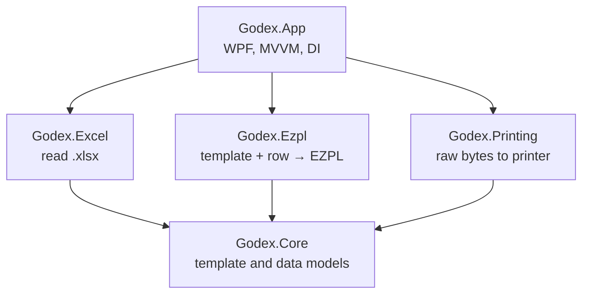

# Godex Label Printer

Windows desktop app that prints product labels on Godex thermal printers using data from Excel.

> **Context:** pet project I started for a jewelry-labeling business that prints product labels from spreadsheets. C#, .NET 8, WPF. 2026. **Work in progress:** the first end-to-end path (Excel → template → printer) works; the visual template editor is next.

<!-- Add a screenshot here:  -->

## Features

**Working now**

- Opens `.xlsx` files without Microsoft Office: choose a sheet, see the data in a table.
- Select rows to print: all, none or a range.
- Lists the printers installed in Windows.
- Prints a test label for the first selected row, using a JSON template where text fields are bound to Excel columns.

**Planned for the MVP**

- Visual template editor: drag and drop text, barcodes, QR codes and lines on a canvas measured in millimetres.
- Live preview with real data from the selected row.
- Batch printing with progress and cancel.
- Network printers over TCP port 9100 and an installer.

## Tech stack

| Layer | Technology |
| --- | --- |
| UI | WPF, WPF-UI (Fluent style), CommunityToolkit.Mvvm |
| App infrastructure | Microsoft.Extensions.DependencyInjection, Serilog |
| Excel | ClosedXML |
| Printing | EZPL (Godex printer language), WinAPI raw printing via P/Invoke |
| Platform | C#, .NET 8, Windows 10/11 |

## Architecture

The solution is split into five projects. Only the app knows about WPF; the rest are plain .NET libraries.



Key decisions:

- **The app sends EZPL commands straight to the printer** instead of printing through the Windows driver. The printer then draws text and barcodes itself, which is faster and gives full control over darkness, speed and print mode.
- **Coordinates are stored in millimetres** and converted to printer dots only when EZPL is generated: 8 dots/mm at 203 DPI, 12 at 300 DPI.
- **Cyrillic text** is sent in Windows-1251, and the label tells the printer to use the same code page.
- **Raw printing** goes through `OpenPrinter`, `StartDocPrinter` and `WritePrinter` from the Windows print spooler API.
- **Templates are JSON files** describing label size, print settings and elements. Example: `Godex.App/SampleTemplates/test-label.json`.

## Project structure

```text
Godex.App/        WPF app: main window, view model, DI and logging setup
Godex.Core/       models: label template, elements, data rows, print settings
Godex.Excel/      Excel reader on ClosedXML
Godex.Ezpl/       EZPL generator, mm-to-dots conversion
Godex.Printing/   raw printing to USB printers through WinAPI
PROJECT_ANALYSIS.md  requirements, alternatives considered and MVP plan (in Russian)
```

## Getting started

Requirements: Windows 10/11, .NET 8 SDK, a Godex printer with its driver installed.

```bash
dotnet build Godex.sln
dotnet run --project Godex.App
```

To print a test label, open an Excel file with columns `Артикул` and `Наименование` (the sample template uses them), pick the printer and press **Печать тестовой бирки** (print test label). The interface is in Russian for now.

## What I'd improve next

- Build the visual template editor and live preview.
- Add barcode and QR elements to the EZPL generator.
- Cover the EZPL generator with unit tests: given a template and a row, compare the exact command output.
